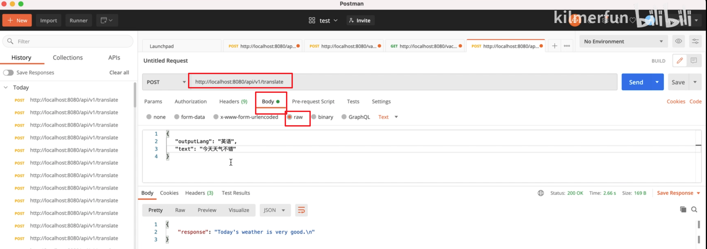

## 1.利用golang加ollama加langchain轻松打造本地LLM应用
2024-04-22 22:56:14
https://www.bilibili.com/video/BV1Qm41127WA/?spm_id_from=333.1387.homepage.video_card.click&vd_source=4212b105520112daf65694a1e5944e23


## 1.1.开发你的第一个LLM应用
·Ollama:本地运行大语言模型（LLM）的一个工具
·Langchaingo:帮助在应用程序中使用大型语言模型（LLM）的编程框架
·Gin:golang的一个web框架


## 1.2.翻译器功能
·提示语：你是一个只能翻译文本的翻译引擎，不需要进行解释。
  翻译这段文字到{{.outputLang}:{.input}}
·比如：你是一个只能翻译文本的翻译引擎，不需要进行解释。翻
译这段文字到英语：今天天气不错。

## 1.3.实现步骤

### 1.3.1 准备
```sh
# --------拉包
$ go get github.com/gin-gonic/gin
$ go get github.com/tmc/langchaingo/llms


~$ ollama list
NAME                                                               ID              SIZE      MODIFIED     
modelscope.cn/nomic-ai/nomic-embed-text-v1.5-GGUF:latest           2420add86055    84 MB     24 hours ago    
modelscope.cn/unsloth/DeepSeek-R1-Distill-Qwen-1.5B-GGUF:latest    b5269f5a5845    1.1 GB    26 hours ago  
# --------启动 ollma
$ ollama serve
```
### 1.3.2code
code : ai/translator/translator.go


```sh
$ go build
$ ./go0base ai 
```

### 1.3.3用postman测试 
 

===================================================================
# 2. postman里如何测试 POST方法

```go
  v1 := r.Group("/api/v1")  
	v1.POST("/translate", translator)
``` 
 在postman里如何测试 ?

 要在Postman中测试这个API端点（`POST /api/v1/translate`），请按照以下步骤操作：


### ### 一、配置请求URL
1. **打开Postman**，点击左上角的 **New** → **Request**
2. **设置请求方法**：选择 **POST**
3. **输入请求URL**：
   ```
   http://localhost:8080/api/v1/translate  # 替换为你的服务器地址
   ```


### ### 二、设置请求头（Headers）
根据接口要求添加必要的请求头：

| Key               | Value                     | 说明                  |
|-------------------|---------------------------|-----------------------|
| Content-Type      | application/json          | 如果请求体是JSON格式  |
| Authorization     | Bearer your_token_here    | 如果需要身份验证      |


### ### 三、设置请求体（Body）
根据 `translator` 函数的预期参数，添加请求体内容：

1. **选择Body类型**：
   - **raw**（原始格式）
   - 右侧下拉菜单选择 **JSON (application/json)**

2. **示例请求体**：
   ```json
   {
       "text": "Hello, world!",
       "targetLanguage": "zh"
   }
   ```


### ### 四、发送请求并查看结果
1. 点击 **Send** 按钮发送请求
2. **查看响应**：
   - **状态码**：期望返回 `200 OK`
   - **响应体**：查看翻译结果
   ```json
   {
       "translation": "你好，世界！"
   }
   ```


### ### 五、常见问题排查
1. **404 Not Found**：
   - 检查服务器是否正在运行（`go run main.go`）
   - 确认端口号（默认8080）
   - 检查URL路径是否正确（大小写、斜杠等）

2. **400 Bad Request**：
   - 检查请求体格式是否正确（JSON语法错误）
   - 确认请求参数是否符合接口要求

3. **500 Internal Server Error**：
   - 检查服务器日志，查看具体错误信息
   - 确保 `translator` 函数正确处理请求


### ### 六、进阶设置（可选）
1. **环境变量管理**：
   - 点击右上角 **Environments** → **Add**
   - 添加变量：
     - `HOST`: `http://localhost:8080`
   - 在URL中使用变量：`{{HOST}}/api/v1/translate`

2. **保存请求**：
   - 点击 **Save**，将请求保存到集合中
   - 便于后续重复测试


通过以上步骤，你可以在Postman中成功测试 `POST /api/v1/translate` 接口。如果遇到问题，请提供具体的错误信息（如状态码、错误日志），以便进一步排查。

