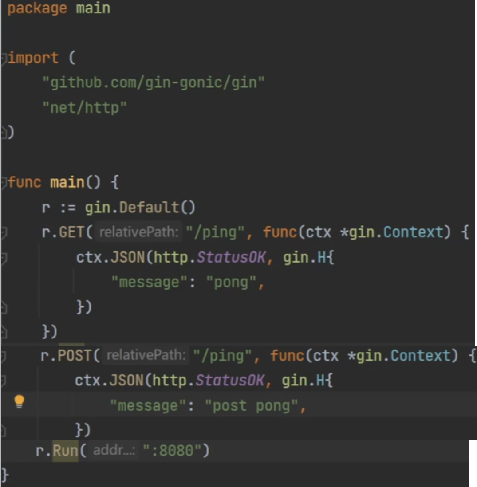

# 2025年最新Golang保姆级公开课教程-零基础也可学！（完整版）
2024-12-31 14:17:39
https://www.bilibili.com/video/BV1Y26GYhEGq?spm_id_from=333.788.videopod.episodes&vd_source=4212b105520112daf65694a1e5944e23&p=26
==================================================  
# 1.【golang框架】大厂都在使用的命令行项目框架cobra
01:28:27
https://www.bilibili.com/video/BV1Y26GYhEGq?spm_id_from=333.788.videopod.episodes&vd_source=4212b105520112daf65694a1e5944e23&p=23


==================================================

# 2.【golang框架】gin框架实现统一鉴权与api版本控制
01:28:03
https://www.bilibili.com/video/BV1Y26GYhEGq?spm_id_from=333.788.videopod.episodes&vd_source=4212b105520112daf65694a1e5944e23&p=24
## 2.0本节内容
> 1.RESTful api 设计
> 2.路由分组实现api版本控制
> 3.中间件拦截请求实现统一鉴权
> 4.模型绑定与验证
 

## 2.1 RESTful api 设计
 
06:26

course增删改查
user注册登录
## 2.2 下载 gin框架
```sh
go get github.com/gin-gonic/gin
```
## 2.3 简单的code

 

## 2.4 api版本控制code  
    fw-gin-test/*
### 2.4.1 api版本控制
v1/course post
v7/course post
v8/course post
其中，api版本控制的代码示例 ： fw-gin-test/routes/course.go

## 2.5 中间件统一鉴权
53:49

```go 
// fw-gin-test/routes/course.go
func initCourse(r *gin.Engine) { 
	v1 := r.Group("/v1", middleware.TokenCheck, middleware.AuthCheck)
  // .....
  v2 := r.Group("/v2", middleware.AuthCheck)
  // .....
}
```

或者全局中间件
```go
// fw-gin-test/routes/routes.go
func InitRoutes(r *gin.Engine) {
	 r.Use(...) // 全局中间件注册
}
```

1:02:59


==================================================
# 3.【golang框架】基于go-kit工具集理解微服务开发
02:35:10 
GitHub 上的 **go-kit** 是一个基于 Go 语言的微服务框架，专注于提供简洁、可复用的工具和模式，帮助开发者构建模块化、可维护的微服务系统。  

## 3.0 本节内容
> 1.基于中间件编程
> 2.服务的限流与熔断
> 3.服务链路追踪及透传
## 3.1 github.com/go-kit 
  https://github.com/go-kit/kit.git 
  
## 3.2 授权 auth 
https://github.com/go-kit/kit/tree/master/auth 

三种鉴权方案：

03:06

======================================================
# 4.【golang框架】gorm 4个优势与4个弊端我们该如何选择
02:01:31

## 4.1.选择orm的理由
> 1.规范一致代码工整
> 2.减少一定的工作量
> 3.对于一些通用系统部署更方便
> 4.解耦数据库与数据访问层，更加方便数据库引擎

## 4.2.不建议使用orm的理由
> 1.数据访问层不会因为使用ORM而显著减小
> 2.大量使用**反射**，导致程序**性能不佳**
> 3.一个没有SQL基础的开发人员，大概率不能通过orm构建正确的SQL
> 4.orm提供的大量表关系接口(即表连接接口)，**数据量大**的情况下会导致**查询性能显著下降**
  * 用 select in 语句，比表连接 快很多。

## 4.3.gorm 4个优势与4个端我们该如何选择
1.4个理由支撑着我们选择ORM
2.4个理由让我们放弃ORM
3.gorm的基本使用与推荐使用
推荐优先使用简单的orm，尽量不用表连接。

## 4.4.官方文档
[gorm.io/zh_CN/docs/index.html](http://gorm.io/zh_CN/docs/index.html)

<https://gorm.io/zh_CN/docs/models.html>

### 4.4.1 高级选项
#### 4.4.1.1字段级权限控制
可导出的字段在使用 GORM 进行 CRUD 时拥有全部的权限，此外，GORM 允许您用标签控制字段级别的权限。这样您就可以让一个字段的权限是只读、只写、只创建、只更新或者被忽略

注意： 使用 GORM Migrator 创建表时，不会创建被忽略的字段

type User struct {
  Name string `gorm:"<-:create"` // 允许读和创建
  Name string `gorm:"<-:update"` // 允许读和更新
  Name string `gorm:"<-"`        // 允许读和写（创建和更新）
  Name string `gorm:"<-:false"`  // 允许读，禁止写
  Name string `gorm:"->"`        // 只读（除非有自定义配置，否则禁止写）
  Name string `gorm:"->;<-:create"` // 允许读和写
  Name string `gorm:"->:false;<-:create"` // 仅创建（禁止从 db 读）
  Name string `gorm:"-"`  // 通过 struct 读写会忽略该字段
  Name string `gorm:"-:all"`        // 通过 struct 读写、迁移会忽略该字段
  Name string `gorm:"-:migration"`  // 通过 struct 迁移会忽略该字段
}

#### 4.4.1.2字段标签
Tags are optional to use when declaring models, GORM supports the following tags: Tags are case insensitive, however camelCase is preferred. If multiple tags are used they should be separated by a semicolon (;). Characters that have special meaning to the parser can be escaped with a backslash (\) allowing them to be used as parameter values.

标签名 | 说明
----|---
column | 指定 db 列名
type | 列数据类型，推荐使用兼容性好的通用类型，例如：所有数据库都支持 bool、int、uint、float、string、time、bytes 并且可以和其他标签一起使用，例如：not null、size, autoIncrement… 像 varbinary(8) 这样指定数据库数据类型也是支持的。在使用指定数据库数据类型时，它需要是完整的数据库数据类型，如：MEDIUMINT UNSIGNED not NULL AUTO_INCREMENT
serializer | 指定将数据序列化或反序列化到数据库中的序列化器, 例如: serializer:json/gob/unixtime
size | 定义列数据类型的大小或长度，例如 size: 256
primaryKey | 将列定义为主键
unique | 将列定义为唯一键
default | 定义列的默认值
precision | 指定列的精度
scale | 指定列大小
not null | 指定列为 NOT NULL
autoIncrement | 指定列为自动增长
autoIncrementIncrement | 自动步长，控制连续记录之间的间隔
embedded | 嵌套字段
embeddedPrefix | 嵌入字段的列名前缀
autoCreateTime | 创建时追踪当前时间，对于 int 字段，它会追踪时间戳秒数，您可以使用 nano/milli 来追踪纳秒、毫秒时间戳，例如：autoCreateTime:nano
autoUpdateTime | 创建/更新时追踪当前时间，对于 int 字段，它会追踪时间戳秒数，您可以使用 nano/milli 来追踪纳秒、毫秒时间戳，例如：autoUpdateTime:milli
index | 根据参数创建索引，多个字段使用相同的名称则创建复合索引，查看 索引 获取详情
uniqueIndex | 与 index 相同，但创建的是唯一索引
check | 创建检查约束，例如 check:age > 13，查看 约束 获取详情
<- | 设置字段写入的权限， <-:create 只创建、<-:update 只更新、<-:false 无写入权限、<- 创建和更新权限
-> | 设置字段读的权限，->:false 无读权限
- | 忽略该字段，- 表示无读写，-:migration 表示无迁移权限，-:all 表示无读写迁移权限
comment | 迁移时为字段添加注释

## 4.5. go get -U gorm.io/gorm
```sh
PS E:\Work\Code\go\ClassroomCode\gorm>    go get -u gorm.io/gorm
go: downloading gorm.io/gorm v1.24.1
go: added github.com/jinzhu/inflection v1.0.0
go: added github.com/jinzhu/now v1.1.5
go: added gorm.io/gorm v1.24.1


PS E: \Work\Code\go\ClassroomCode\gorm>    go get gorm.io/driver/mysql
go: downloading gorm.io/driver/mysql v1.4.3
go: added github.com/go-sql-driver/mysql v1.6.0
added gorm.io/driver/mysql v1.4.3
```
## 4.6. gorm/conn.go
  https://gorm.io/zh_CN/docs/connecting_to_the_database.html

## 4.7. gorm/models.go
  https://gorm.io/zh_CN/docs/models.html

## 4.8. gorm/migration.go
  https://gorm.io/zh_CN/docs/migration.html

 

 
## 4.9 入库操作： 
   https://gorm.io/zh_CN/docs/create.html
> 1.指定表或者model
> 2.正向选择或者反向选择哪些字段入库 （正选或者反选 字段）
> 3.单挑记录还是批量，批量可以指定每批次处理记录条数
   

### 4.9.1 gorm/create.go
 
### 4.10. 数据查询：
  https://gorm.io/zh_CN/docs/query.html

> 1.指定表或者model
> 2.正向选择或者反向选择查询字段（正选或者反选 字段）
> 3.where 子句构建(and、or、in、not等)
> 4.orderby子句
> 5.grouphaving子句
> 6.limit offset子句
> 7.查询条目，一条或多条
> 8.结果填充，填充到对象、集合、切片

### 4.10.1 gorm/query.go 


## 4.11 数据更新：
> 1.指定表或者model
> 2.选择更新字段
> 3.where 子句

## 4.12 删除
1.指定表或者model
2.where 子句

## 4.13 事务：
https://gorm.io/zh_CN/docs/transactions.html

> 1.普通事务
> 2.嵌套事务
> 3.手动事务
> 4.savepoint 与 rollback

## 4.14.关联
**不建议用**
https://gorm.io/zh_CN/docs/belongs_to.html
 https://gorm.io/zh_CN/docs/associations.html

## 附:云原生课程大纲2022

 

 

======================================================
# 5.【golang框架】如何使用rpc框架grpc开发微服务项目
01:18:48
## 5.1本节内容
> 1.protobuf协议声明服务与消息
> 2.一元请求与流式请求
> 3.header与trailer元数据传递


## 5.2grpc用于项目开发步骤 
> 1.安装protoc编译器(protoc-22.0-win64)，根据protobuf定义的文件生成grpc客户端与服务端存根
>     从 [官网](https://github.com/protocolbuffers/protobuf/releases) 下载对应系统的
>     二进制包（如 protoc-31.1-linux-x86_64.zip），解压后将 protoc 加入环境变量。
> 2.安装protoc-gen-go插件，生成message
>     go install google.golang.org/protobuf/cmd/protoc-gen-go@latest
> 3.安装protoc-gen-go-grpc插件，生成grpc服务的客户端与服务存根
>     go install google.golang.org/grpc/cmd/protoc-gen-go-grpc@latest
> 4.protobuf定义message与service 
> 5.通过protoc生成grpc服务代码 
> 6.基于服务端存根实现grpcserver端 
> 7.将存根共享给客户端，以便客户端rpc调用server端
  

## 5.3 "*.proto"的message 结构中字段的标识号规则

在 Protocol Buffers（protobuf）中，`message` 结构中的字段标识号（field numbers）是每个字段的唯一标识符，用于在序列化后的数据中标识字段。以下是关于字段标识号的规则和注意事项：


### 5.3.1、基本规则
(1). **唯一性**  
   - 每个字段在同一 `message` 中必须有唯一的标识号，不能重复。
   - 不同 `message` 中的字段可以使用相同的标识号（互不影响）。

(2). **数值范围**  
   - **1 ~ 15**：使用 1 字节编码，推荐用于频繁出现的字段。
   - **16 ~ 2047**：使用 2 字节编码，适用于非频繁字段。
   - **19000 ~ 19999**：被 Protocol Buffers 保留，**禁止使用**。
   - **2048+**：编码效率更低（占用更多字节），但可用于扩展字段。

(3). **不可修改性**  
   - 一旦消息被使用，**不要修改已有字段的标识号**，否则会导致兼容性问题（旧数据无法正确解析）。


### 5.3.2、特殊场景处理
(1). **删除字段**  
   - 删除字段时，**不要重用其标识号**，避免与旧数据冲突。
   - 可通过 `reserved` 关键字标记已删除的字段号：
     ```protobuf
     message User {
       // 字段 1 已删除，保留其标识号避免重用
       reserved 1;
       // 保留多个字段号
       reserved 2, 15, 9 to 11;
       // 保留字段名（避免被重新定义）
       reserved "old_field_name";
     }
     ```

(2). **扩展字段**  
   - 对于可能新增的字段，建议预留一些标识号（如 16~19），避免后续因字段号不足导致兼容性问题。


### 5.3.3、性能优化建议
(1). **优先使用小数字段号**  
   - 字段号越小，编码后的数据体积越小。例如：
     ```protobuf
     message Person {
       // 频繁出现的字段使用 1~15
       string name = 1;     // 高频字段，使用 1 字节编码
       int32 id = 2;        // 高频字段
       // 非高频字段使用 16+
       string email = 16;   // 低频字段，使用 2 字节编码
     }
     ```

(2). **避免跳号**  
   - 尽量连续分配字段号，减少编码空间浪费。


### 5.3.4、与 JSON/XML 的对比
- **JSON/XML**：通过字段名（如 `name`、`id`）标识数据，可读性高但体积大。
- **Protobuf**：通过数字标识号（如 `1`、`2`）序列化，体积小但可读性差（需配合 `.proto` 文件解析）。


### 5.3.5、版本兼容性注意事项
- **向前兼容**：新版本 `.proto` 文件添加字段时，旧客户端可以解析新数据（忽略未知字段）。
- **向后兼容**：新版本删除字段时，旧客户端可能无法正确解析新数据（需通过 `reserved` 避免重用字段号）。


### 5.3.6、示例
```protobuf
syntax = "proto3";

message SearchRequest {
  // 常用字段使用小字段号
  string query = 1;     // 1 字节编码
  int32 page_number = 2;  // 1 字节编码
  int32 result_per_page = 3;  // 1 字节编码
  
  // 保留字段号 16~19 用于未来扩展
  reserved 16 to 19;
  
  // 低频字段使用较大字段号
  bool is_cached = 20;  // 2 字节编码
}
```
 
通过合理规划字段标识号，可以在保证兼容性的同时优化序列化性能。

## 5.4 *.proto的service 结构中rpc的参数规则
在 Protocol Buffers (protobuf) 中，`service` 结构用于定义 gRPC 服务的接口，其中的 `rpc` 方法定义了客户端和服务器之间的通信契约。以下是关于 `rpc` 参数的规则和注意事项：


### 5.4.1、基本规则
(1). **输入和输出类型**  
   - 每个 `rpc` 方法必须指定一个输入参数类型和一个输出参数类型，且**必须是 `message` 类型**（不能是基本类型如 `int32`、`string` 等）。
   - 示例：
     ```protobuf
     service SearchService {
       // 普通 RPC：客户端发送单个请求，服务器返回单个响应
       rpc Search (SearchRequest) returns (SearchResponse);
     }
     
     message SearchRequest {
       string query = 1;
     }
     
     message SearchResponse {
       repeated Result results = 1;
     }
     
     message Result {
       string title = 1;
     }
     ```

(2). **流式 RPC**  
   - gRPC 支持四种调用模式，通过 `stream` 关键字标记：
     - **普通 RPC**：无 `stream` 标记，客户端发送一个请求，服务器返回一个响应。
     - **客户端流式 RPC**：`stream` 标记在输入参数前，客户端发送多个请求，服务器返回一个响应。
       ```protobuf
       rpc RecordRoute(stream Point) returns (RouteSummary) {}
       ```
     - **服务器流式 RPC**：`stream` 标记在输出参数前，客户端发送一个请求，服务器返回多个响应。
       ```protobuf
       rpc ListFeatures(Point) returns (stream Feature) {}
       ```
     - **双向流式 RPC**：`stream` 标记在输入和输出参数前，客户端和服务器可以同时发送多个消息。
       ```protobuf
       rpc RouteChat(stream RouteNote) returns (stream RouteNote) {}
       ```


### 5.4.2、参数约束
(1). **参数数量限制**  
   - 每个 `rpc` 方法**只能有一个输入参数和一个输出参数**。如果需要传递多个值，应将它们封装在一个 `message` 中。
   - 错误示例（直接使用多个参数）：
     ```protobuf
     // ❌ 错误：RPC 方法不能有多个输入参数
     rpc Search(string query, int32 page) returns (SearchResponse) {}
     ```
   - 正确示例（使用 message 封装参数）：
     ```protobuf
     message SearchRequest {
       string query = 1;
       int32 page = 2;
     }
     
     rpc Search(SearchRequest) returns (SearchResponse) {}
     ```

(2). **参数类型限制**  
   - 输入和输出参数必须是 `.proto` 文件中定义的 `message` 类型，不能是基本类型或其他非 `message` 类型。
   - 错误示例（使用基本类型作为返回值）：
     ```protobuf
     // ❌ 错误：返回值必须是 message 类型
     rpc GetUserCount() returns (int32) {}
     ```
   - 正确示例：
     ```protobuf
     message UserCountResponse {
       int32 count = 1;
     }
     
     rpc GetUserCount() returns (UserCountResponse) {}
     ```


### 5.4.3、错误处理
- gRPC 使用 `Status` 消息表示错误状态，包含状态码（如 `INVALID_ARGUMENT`、`NOT_FOUND`）和错误信息。
- 客户端可以通过捕获异常获取错误详情，例如在 Go 中：
  ```go
  if err != nil {
    if status, ok = status.FromError(err); ok {
      log.Printf("RPC 错误: %v", status.Message())
    }
  }
  ```


### 5.4.4、元数据（Metadata）
- 除了主参数外，gRPC 允许通过 `metadata` 传递额外信息（如认证令牌、请求头），但这些信息不直接在 `.proto` 文件中定义，而是在代码中处理。
- 例如，在 Python 中：
  ```python
  # 客户端发送元数据
  response = stub.Search(request, metadata=[('auth-token', 'token123')])
  
  # 服务器接收元数据
  def Search(self, request, context):
    metadata = dict(context.invocation_metadata())
    token = metadata.get('auth-token')
  ```


### 5.4.5、性能优化建议
(1). **避免大消息**  
   - 对于大数据集，优先使用流式 RPC 而非一次性传输大消息，减少内存压力。
   - 例如，处理大量数据时：
     ```protobuf
     // 服务器流式 RPC 更适合大数据集
     rpc GetLargeDataset(Empty) returns (stream DataChunk) {}
     
     message DataChunk {
       bytes data = 1;
     }
     ```

(2). **合理设计 message 结构**  
   - 为 `rpc` 方法的输入和输出设计专门的 `message`，避免过度复用导致兼容性问题。


### 5.4.6、版本兼容性
- 与 `message` 类似，`service` 和 `rpc` 的变更也需要遵循兼容性规则：
  - **添加新方法**：向后兼容（旧客户端不会调用新方法）。
  - **删除方法**：不兼容（旧客户端可能尝试调用已删除的方法）。
  - **修改方法签名**：不兼容（输入/输出类型变化会导致序列化/反序列化失败）。


### 5.4.7、示例
```protobuf
syntax = "proto3";

package example;

// 空消息（用于无参数的 RPC）
message Empty {}

// 服务定义
service UserService {
  // 普通 RPC
  rpc GetUser (GetUserRequest) returns (User) {}
  
  // 客户端流式 RPC（批量添加用户）
  rpc AddUsers (stream User) returns (AddUsersResponse) {}
  
  // 服务器流式 RPC（实时推送用户变更）
  rpc WatchUsers (Empty) returns (stream UserChange) {}
  
  // 双向流式 RPC（聊天服务）
  rpc Chat (stream ChatMessage) returns (stream ChatMessage) {}
}

// 消息定义
message GetUserRequest {
  string user_id = 1;
}

message User {
  string id = 1;
  string name = 2;
}

message AddUsersResponse {
  int32 success_count = 1;
}

message UserChange {
  enum Type {
    CREATED = 0;
    UPDATED = 1;
    DELETED = 2;
  }
  Type type = 1;
  User user = 2;
}

message ChatMessage {
  string sender = 1;
  string content = 2;
}
```
 
通过合理设计 `rpc` 参数和消息结构，可以确保 gRPC 服务的性能、兼容性和可维护性。

## 5.5 protobuf定义message与service 在echo.proto中  
 

## 5.6 通过protoc生成message 
```sh
cd go0base/
# generata go0base/grpc/echo/echo.pb.go
a@a:~/gopath/src/go0base$ protoc --go_out=.  --go_opt=paths=source_relative ./grpc/echo/echo.proto
```
## 5.7 生成grpc服务的客户端与服务存根 echo_grpc.pb.go
用protoc-gen-go-grpc插件生成grpc服务的客户端与服务存根 echo_grpc.pb.go
```sh
cd go0base/
# generata go0base/grpc/echo/echo_grpc.pb.go
a@a:~/gopath/src/go0base$ protoc --go-grpc_out=.  --go-grpc_opt=paths=source_relative ./grpc/echo/echo.proto
# 安装依赖
a@a:~/gopath/src/go0base$ go mod tidy
```

## echo-server 编码
go0base/grpc/echo-server/server/server.go
go0base/grpc/echo-server/main.go
```sh
~/gopath/gopath/src/go0base/grpc/echo-server$ go run ./main.go 

server recv message :name:"nick"  addr:{province:"湖南"  city:"长沙"}  birthday:{seconds:1749025674  nanos:186459239}  data:"今天天气不错"  gender:MALE  hobby:"羽毛球"  hobby:"携带名"  hobby:"看博客" 
```
## echo-cli 编码
go0base/grpc/echo-cli/main.go

```sh
~/gopath/src/go0base/grpc/echo-cli$ go run ./main.go 

name:"nick"  addr:{province:"湖南"  city:"长沙"}  birthday:{seconds:1749025674  nanos:186459239}  data:"今天天气不错"  gender:MALE  hobby:"羽毛球"  hobby:"携带名"  hobby:"看博客"
```


==================================================
# 6.【golang框架】轻量级认证机制jwt的4种签名方式
01:36:53


==================================================
# 7.【golang框架】最受欢迎的开源日志框架logrus实战应用
02:09:33 
https://www.bilibili.com/video/BV1Y26GYhEGq/?spm_id_from=333.788.videopod.episodes&vd_source=4212b105520112daf65694a1e5944e23&p=29

## 7.1本节内容
> 1.为什么需要打印日志，解决哪些问题
> 2.logrus基本操作与hook使用
> 3.logrus如何将日志输出到网络日志服务
> 4.公有云日志分析及日志警告策略
> 

## 7.2 logrus源码的github地址
 https://github.com/sirupsen/logrus.git
 
 demo code见：go0base/logrusdemo/logrusdemo.go
13:38


==================================================
# 8.【golang框架】OpenTelemetry分布式链路追踪与监控
01:52:17
https://www.bilibili.com/video/BV1Y26GYhEGq?spm_id_from=333.788.videopod.episodes&vd_source=4212b105520112daf65694a1e5944e23&p=30

## 8.0本节内容
> 1.OpenTelemetry是什么能做什么
> 2.OpenTelemetry关键概念
> 3.SDK采集服务追踪数据
> 4.SDK采集服务监控数据

## 8.1为什么需要分布式追踪
> 1.分布式+微服务的场景下，数据流比较复杂，不容易定位错误
>    （单机应用，代码的调用链路十分清晰，不需要分布式追踪）    
> 2.监控数据的采集，按服务采集（服务器性能监控数据，业务数据监控）
> 
## 8.2 OpenTelemetry是什么 
 

> 1.和提供商无关开源的可观测性框架，用于检测、生成、收集和导出遥测数据（追踪，metrics，日志）
> 2.目的提供一套标准的SDk和provider无关
> 3.由openTracing和openCensus开源项目合并而来,
> 4.可接入 openTracing、openCensus 以及 zipkin、jaeger

 opentelemetry-go的github地址：
[opentelemetry-go/](https://github.com/open-telemetry/opentelemetry-go.git)

## 8.3 OpenTelemetry关键概念
追踪的相关概念
> 1.TracerProvider：是Tracer的工厂，用于创建tracer
> 2.Tracer:跟踪程序，用于创建Span。
> 3.TraceExporter：追踪数据导出器。
> 4.ContextPropagation：上下文用于保存数据，传播序列化或反序列化上下文
> 5.Span:跨度，表示一个工作或者操作单元(abner注：常指 方法)


Metrics（abner注：监控指标、度量）相关概念
> 1.MeterProvider：mter的工厂，用于创建meter对象
> 2.Meter：仪表，在运行时捕获服务的测量值。
> 3.MetricExporter：度量数据导出器
> 4.Metric类型：Counter，实时指标，直方图

Attributes,Resource


使用流程：
> 1.应用程序启动，创建provider
> 2.每一个流程，通过provider创建tracer或者meter
> 3.每个方法一个通过tracer创建span，方法结束span结束

## 8.4 SDK 采集 服务追踪数据
48:52


==================================================
# 9.【golang框架】go开源验证框架validator必会的3个操作
01:27:55


