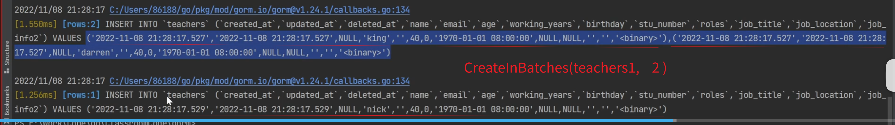

# 2025年最新Golang保姆级公开课教程-零基础也可学！（完整版）
2024-12-31 14:17:39
https://www.bilibili.com/video/BV1Y26GYhEGq?spm_id_from=333.788.videopod.episodes&vd_source=4212b105520112daf65694a1e5944e23&p=26
==================================================  
# 1.【golang框架】大厂都在使用的命令行项目框架cobra
01:28:27


==================================================
# 2.【golang框架】gin框架实现统一鉴权与api版本控制
 

==================================================
# 3.【golang框架】基于go-kit工具集理解微服务开发
附录： from ai 
## 3.1 github.com/go-kit 
  https://github.com/go-kit/kit.git 

GitHub 上的 **go-kit** 是一个基于 Go 语言的微服务框架，专注于提供简洁、可复用的工具和模式，帮助开发者构建模块化、可维护的微服务系统。  


### 3.1.1**核心特点**
- **轻量级设计**：不强制架构约束，仅提供基础组件（如服务接口定义、中间件等），灵活性高。  
- **接口抽象**：通过定义统一的服务接口（如 `Service` 接口），分离业务逻辑与技术实现（如网络传输、日志等）。  
- **中间件机制**：支持通过中间件链式调用添加横切关注点（如认证、监控、超时处理），代码结构清晰。  
- **多协议支持**：内置 HTTP、gRPC 等传输层实现，方便服务间通信与对外暴露接口。  

### 3.1.2**典型应用场景**
- 构建微服务架构中的独立服务模块。  
- 为服务添加可复用的功能（如日志记录、错误处理）。  
- 统一服务接口定义，便于团队协作和服务治理。

### 3.1.3**使用示例（简化版）**
(1). **定义服务接口**  
```go
type UserService interface {
    GetUser(id string) (User, error)
    CreateUser(user User) error
}
```

(2). **实现业务逻辑**  
```go
type userService struct {
    // 依赖注入数据库等资源
}

func (s *userService) GetUser(id string) (User, error) {
    // 业务逻辑
}
```

(3). **添加中间件**  
```go
func LoggingMiddleware(logger log.Logger) Middleware {
    return func(next UserService) UserService {
        return &loggingUserService{logger, next}
    }
}
```

(4). **服务封装与暴露**  
```go
// HTTP 服务
httpHandler := httptransport.NewServer(
    service,
    decodeRequest,
    encodeResponse,
)
```


### 3.1.4**在 GitHub 上的资源**
- **仓库地址**：[github.com/go-kit/kit](https://github.com/go-kit/kit)  
- **文档**：仓库内包含详细的使用指南、示例代码和 API 说明。  
- **社区**：适合 Go 语言开发者学习微服务设计模式，或直接用于生产环境的服务架构搭建。  

如果需要具体功能的实现细节，可以进一步探讨！

 
## 3.2  如何使用go-kit构建微服务？
使用 go-kit 构建微服务需遵循“接口抽象-业务实现-中间件增强-服务暴露”的流程，以下是完整实践步骤及示例：
### 3.2.1、环境准备与项目结构
(1).安装依赖
```sh
go get github.com/go-kit/kit
```

(2)推荐项目结构
```
service/
├── cmd/          # 启动文件
│   └── main.go  
├── internal/     # 核心逻辑
│   ├── service/  # 服务接口与实现
│   ├── repository/ # 数据访问
│   └── model/    # 数据模型
├── transport/    # 传输层实现
│   ├── http/     # HTTP 接口
│   └── grpc/     # gRPC 接口
└── pkg/          # 可复用工具
```
### 3.2.2 核心步骤：从接口到服务
(1). 定义服务接口（抽象业务逻辑）
```go
// internal/service/user.go
package service

import "context"

// UserService 定义用户服务接口
type UserService interface {
    GetUser(ctx context.Context, id string) (User, error)
    CreateUser(ctx context.Context, user User) error
}

// User 数据模型
type User struct {
    ID   string
    Name string
    Age  int
}
```

(2). 实现业务逻辑（核心功能）

```go
// internal/service/user_impl.go
package service

import (
    "context"
    "errors"
)

// userServiceImpl 实现 UserService 接口
type userServiceImpl struct {
    // 依赖注入（如数据库连接）
    userRepo UserRepository
}

// NewUserService 创建服务实例
func NewUserService(repo UserRepository) UserService {
    return &userServiceImpl{userRepo: repo}
}

// GetUser 获取用户信息
func (s *userServiceImpl) GetUser(ctx context.Context, id string) (User, error) {
    if id == "" {
        return User{}, errors.New("用户ID不能为空")
    }
    return s.userRepo.FindByID(ctx, id)
}

// CreateUser 创建用户
func (s *userServiceImpl) CreateUser(ctx context.Context, user User) error {
    // 业务校验
    if user.Name == "" {
        return errors.New("用户名不能为空")
    }
    return s.userRepo.Save(ctx, user)
}

// UserRepository 数据访问接口（示例）
type UserRepository interface {
    FindByID(ctx context.Context, id string) (User, error)
    Save(ctx context.Context, user User) error
}
```

(3). 添加中间件（增强非业务功能）
```go
// internal/service/middleware.go
package service

import (
    "context"
    "log"
    "time"
)

// LoggingMiddleware 日志中间件
func LoggingMiddleware(logger *log.Logger) Middleware {
    return func(next UserService) UserService {
        return &loggingUserService{logger, next}
    }
}

// TimingMiddleware 耗时统计中间件
func TimingMiddleware() Middleware {
    return func(next UserService) UserService {
        return &timingUserService{next}
    }
}

// Middleware 中间件类型定义
type Middleware func(UserService) UserService

// loggingUserService 日志中间件包装器
type loggingUserService struct {
    logger *log.Logger
    next   UserService
}

func (s *loggingUserService) GetUser(ctx context.Context, id string) (User, error) {
    s.logger.Printf("调用 GetUser，ID: %s\n", id)
    start := time.Now()
    user, err := s.next.GetUser(ctx, id)
    s.logger.Printf("GetUser 耗时: %v，错误: %v\n", time.Since(start), err)
    return user, err
}

// 同理实现 CreateUser 方法...
```
(4). 封装传输层（暴露服务接口）
HTTP 接口实现
```go
// transport/http/user_http.go
package http

import (
    "context"
    "encoding/json"
    "net/http"
    "service/internal/service"

    "github.com/go-kit/kit/transport/http"
)

// 定义请求/响应结构体
type getUserRequest struct {
    ID string `json:"id"`
}

type getUserResponse struct {
    User service.User `json:"user"`
    Err  string       `json:"err,omitempty"`
}

// 创建 HTTP 处理函数
func NewHTTPHandler(s service.UserService) http.Handler {
    mux := http.NewServeMux()
    
    // 注册 GET /users/:id 接口
    mux.Handle("/users/", http.HandlerFunc(func(w http.ResponseWriter, r *http.Request) {
        // 解码请求
        var req getUserRequest
        if err := json.NewDecoder(r.Body).Decode(&req); err != nil {
            http.Error(w, err.Error(), http.StatusBadRequest)
            return
        }
        
        // 调用服务
        user, err := s.GetUser(r.Context(), req.ID)
        if err != nil {
            json.NewEncoder(w).Encode(getUserResponse{Err: err.Error()})
            return
        }
        
        // 编码响应
        json.NewEncoder(w).Encode(getUserResponse{User: user})
    }))
    
    return mux
}
```

gRPC 接口实现（简化示例）
```go
// transport/grpc/user_grpc.go
package grpc

import (
    "context"
    "service/internal/service"

    pb "service/proto/user" // gRPC 生成的 proto 包
    "github.com/go-kit/kit/transport/grpc"
)

// grpcUserService 实现 gRPC 服务接口
type grpcUserService struct {
    getUser  grpc.Handler
    createUser grpc.Handler
}

// 实现 proto 定义的 UserServiceServer 接口
func (s *grpcUserService) GetUser(ctx context.Context, req *pb.GetUserRequest) (*pb.GetUserResponse, error) {
    _, resp, err := s.getUser.ServeGRPC(ctx, req)
    if err != nil {
        return nil, err
    }
    return resp.(*pb.GetUserResponse), nil
}

func (s *grpcUserService) CreateUser(ctx context.Context, req *pb.CreateUserRequest) (*pb.CreateUserResponse, error) {
    _, resp, err := s.createUser.ServeGRPC(ctx, req)
    if err != nil {
        return nil, err
    }
    return resp.(*pb.CreateUserResponse), nil
}

// NewGRPCServer 创建 gRPC 服务
func NewGRPCServer(s service.UserService) pb.UserServiceServer {
    // 定义 gRPC 处理器
    getUserHandler := grpc.NewServer(
        func(ctx context.Context, request interface{}) (interface{}, error) {
            req := request.(*pb.GetUserRequest)
            return s.GetUser(ctx, req.Id)
        },
        // 响应编码器等配置...
    )
    
    createUserHandler := grpc.NewServer(
        // 同理实现 CreateUser 处理器...
    )
    
    return &grpcUserService{
        getUser:  getUserHandler,
        createUser: createUserHandler,
    }
}
```
(5). 服务组装与启动
```go
// cmd/main.go
package main

import (
    "context"
    "log"
    "net/http"
    "service/internal/service"
    "service/transport/http"
    "service/transport/grpc"
    
    "google.golang.org/grpc"
)

func main() {
    // 1. 初始化依赖（如数据库）
    userRepo := initUserRepository() // 实现略
    
    // 2. 创建核心服务
    coreService := service.NewUserService(userRepo)
    
    // 3. 应用中间件
    logger := log.New(os.Stdout, "user-service: ", log.LstdFlags)
    serviceWithMiddleware := service.LoggingMiddleware(logger)(
        service.TimingMiddleware()(coreService),
    )
    
    // 4. 启动 HTTP 服务
    httpHandler := http.NewHTTPHandler(serviceWithMiddleware)
    go func() {
        log.Println("HTTP 服务启动在 :8080")
        log.Fatal(http.ListenAndServe(":8080", httpHandler))
    }()
    
    // 5. 启动 gRPC 服务
    grpcServer := grpc.NewGRPCServer(serviceWithMiddleware)
    grpcListener, err := net.Listen("tcp", ":8081")
    if err != nil {
        log.Fatalf("gRPC 监听失败: %v", err)
    }
    grpcSrv := grpc.NewServer()
    pb.RegisterUserServiceServer(grpcSrv, grpcServer)
    log.Println("gRPC 服务启动在 :8081")
    log.Fatal(grpcSrv.Serve(grpcListener))
}
```
### 3.3.3、进阶实践：服务注册与发现
结合 Consul 实现服务注册：
```go
// pkg/registry/consul.go
package registry

import (
    "github.com/go-kit/kit/sd/consul"
    "github.com/hashicorp/consul/api"
)

func RegisterWithConsul(serviceName, address string, port int) {
    client, err := api.NewClient(api.DefaultConfig())
    if err != nil {
        panic(err)
    }
    
    // 服务注册配置
    reg := &api.AgentServiceRegistration{
        ID:      serviceName + "-" + address,
        Name:    serviceName,
        Address: address,
        Port:    port,
        // 健康检查配置...
    }
    
    if err := client.Agent().ServiceRegister(reg); err != nil {
        panic(err)
    }
    log.Printf("服务 %s 已注册到 Consul\n", serviceName)
}
```
### 3.3.4 最佳实践与注意事项
(1).接口设计原则：
服务接口尽量简洁，避免大而全的接口定义。
使用 context 传递请求上下文（如超时、认证信息）。
(2).中间件应用：
按功能拆分中间件（日志、认证、限流等），便于复用。
中间件顺序影响执行流程（如认证应在业务逻辑前，日志应包裹全流程）。
(3).错误处理：
定义统一的错误类型或错误码，便于跨服务错误处理。
在传输层将业务错误转换为对应协议的错误格式（如 HTTP 状态码、gRPC 状态）。
(4).性能优化：
避免在中间件中执行耗时操作（如频繁 I/O）。
对高频调用服务可添加缓存中间件。

通过以上步骤，可基于 go-kit 构建出模块化、可维护的微服务。实际项目中需根据业务复杂度补充服务治理、监控告警等功能，或结合第三方库（如 Prometheus、Jaeger）完善系统能力。


======================================================
# 4.【golang框架】gorm 4个优势与4个弊端我们该如何选择
02:01:31

## 4.1.选择orm的理由
> 1.规范一致代码工整
> 2.减少一定的工作量
> 3.对于一些通用系统部署更方便
> 4.解耦数据库与数据访问层，更加方便数据库引擎

## 4.2.不建议使用orm的理由
> 1.数据访问层不会因为使用ORM而显著减小
> 2.大量使用**反射**，导致程序**性能不佳**
> 3.一个没有SQL基础的开发人员，大概率不能通过orm构建正确的SQL
> 4.orm提供的大量表关系接口(即表连接接口)，**数据量大**的情况下会导致**查询性能显著下降**
  * 用 select in 语句，比表连接 快很多。

## 4.3.gorm 4个优势与4个端我们该如何选择
1.4个理由支撑着我们选择ORM
2.4个理由让我们放弃ORM
3.gorm的基本使用与推荐使用
推荐优先使用简单的orm，尽量不用表连接。

## 4.4.官方文档
[gorm.io/zh_CN/docs/index.html](http://gorm.io/zh_CN/docs/index.html)

<https://gorm.io/zh_CN/docs/models.html>

### 4.4.1 高级选项
#### 4.4.1.1字段级权限控制
可导出的字段在使用 GORM 进行 CRUD 时拥有全部的权限，此外，GORM 允许您用标签控制字段级别的权限。这样您就可以让一个字段的权限是只读、只写、只创建、只更新或者被忽略

注意： 使用 GORM Migrator 创建表时，不会创建被忽略的字段

type User struct {
  Name string `gorm:"<-:create"` // 允许读和创建
  Name string `gorm:"<-:update"` // 允许读和更新
  Name string `gorm:"<-"`        // 允许读和写（创建和更新）
  Name string `gorm:"<-:false"`  // 允许读，禁止写
  Name string `gorm:"->"`        // 只读（除非有自定义配置，否则禁止写）
  Name string `gorm:"->;<-:create"` // 允许读和写
  Name string `gorm:"->:false;<-:create"` // 仅创建（禁止从 db 读）
  Name string `gorm:"-"`  // 通过 struct 读写会忽略该字段
  Name string `gorm:"-:all"`        // 通过 struct 读写、迁移会忽略该字段
  Name string `gorm:"-:migration"`  // 通过 struct 迁移会忽略该字段
}

#### 4.4.1.2字段标签
Tags are optional to use when declaring models, GORM supports the following tags: Tags are case insensitive, however camelCase is preferred. If multiple tags are used they should be separated by a semicolon (;). Characters that have special meaning to the parser can be escaped with a backslash (\) allowing them to be used as parameter values.

标签名 | 说明
----|---
column | 指定 db 列名
type | 列数据类型，推荐使用兼容性好的通用类型，例如：所有数据库都支持 bool、int、uint、float、string、time、bytes 并且可以和其他标签一起使用，例如：not null、size, autoIncrement… 像 varbinary(8) 这样指定数据库数据类型也是支持的。在使用指定数据库数据类型时，它需要是完整的数据库数据类型，如：MEDIUMINT UNSIGNED not NULL AUTO_INCREMENT
serializer | 指定将数据序列化或反序列化到数据库中的序列化器, 例如: serializer:json/gob/unixtime
size | 定义列数据类型的大小或长度，例如 size: 256
primaryKey | 将列定义为主键
unique | 将列定义为唯一键
default | 定义列的默认值
precision | 指定列的精度
scale | 指定列大小
not null | 指定列为 NOT NULL
autoIncrement | 指定列为自动增长
autoIncrementIncrement | 自动步长，控制连续记录之间的间隔
embedded | 嵌套字段
embeddedPrefix | 嵌入字段的列名前缀
autoCreateTime | 创建时追踪当前时间，对于 int 字段，它会追踪时间戳秒数，您可以使用 nano/milli 来追踪纳秒、毫秒时间戳，例如：autoCreateTime:nano
autoUpdateTime | 创建/更新时追踪当前时间，对于 int 字段，它会追踪时间戳秒数，您可以使用 nano/milli 来追踪纳秒、毫秒时间戳，例如：autoUpdateTime:milli
index | 根据参数创建索引，多个字段使用相同的名称则创建复合索引，查看 索引 获取详情
uniqueIndex | 与 index 相同，但创建的是唯一索引
check | 创建检查约束，例如 check:age > 13，查看 约束 获取详情
<- | 设置字段写入的权限， <-:create 只创建、<-:update 只更新、<-:false 无写入权限、<- 创建和更新权限
-> | 设置字段读的权限，->:false 无读权限
- | 忽略该字段，- 表示无读写，-:migration 表示无迁移权限，-:all 表示无读写迁移权限
comment | 迁移时为字段添加注释

## 4.5. go get -U gorm.io/gorm
```sh
PS E:\Work\Code\go\ClassroomCode\gorm>    go get -u gorm.io/gorm
go: downloading gorm.io/gorm v1.24.1
go: added github.com/jinzhu/inflection v1.0.0
go: added github.com/jinzhu/now v1.1.5
go: added gorm.io/gorm v1.24.1


PS E: \Work\Code\go\ClassroomCode\gorm>    go get gorm.io/driver/mysql
go: downloading gorm.io/driver/mysql v1.4.3
go: added github.com/go-sql-driver/mysql v1.6.0
added gorm.io/driver/mysql v1.4.3
```
## 4.6. gorm/conn.go
  https://gorm.io/zh_CN/docs/connecting_to_the_database.html

## 4.7. gorm/models.go
  https://gorm.io/zh_CN/docs/models.html

## 4.8. gorm/migration.go
  https://gorm.io/zh_CN/docs/migration.html

 

 
## 4.9 入库操作： 
   https://gorm.io/zh_CN/docs/create.html
> 1.指定表或者model
> 2.正向选择或者反向选择哪些字段入库 （正选或者反选 字段）
> 3.单挑记录还是批量，批量可以指定每批次处理记录条数
   

### 4.9.1 gorm/create.go
 
### 4.10. 数据查询：
  https://gorm.io/zh_CN/docs/query.html

> 1.指定表或者model
> 2.正向选择或者反向选择查询字段（正选或者反选 字段）
> 3.where 子句构建(and、or、in、not等)
> 4.orderby子句
> 5.grouphaving子句
> 6.limit offset子句
> 7.查询条目，一条或多条
> 8.结果填充，填充到对象、集合、切片

### 4.10.1 gorm/query.go 


## 4.11 数据更新：
> 1.指定表或者model
> 2.选择更新字段
> 3.where 子句

## 4.12 删除
1.指定表或者model
2.where 子句

## 4.13 事务：
https://gorm.io/zh_CN/docs/transactions.html

> 1.普通事务
> 2.嵌套事务
> 3.手动事务
> 4.savepoint 与 rollback

## 4.14.关联
**不建议用**
https://gorm.io/zh_CN/docs/belongs_to.html
 https://gorm.io/zh_CN/docs/associations.html

## 附:云原生课程大纲2022

 

 

======================================================
# 5.【golang框架】如何使用rpc框架grpc开发微服务项目
## 5.1.Golang 与 Protobuf 的结合使用
 
### 5.1.1什么是 Protobuf？
Protobuf（Protocol Buffers）是谷歌开发的一种数据序列化格式，特点是高效、跨平台、语言中立，常用于微服务通信、数据存储等场景。相比 JSON/XML，它序列化后体积更小、解析速度更快。

### 5.1.2在 Golang 中使用 Protobuf 的步骤

#### 5.1.2.1环境准备
#### 5.1.2.2安装 Protobuf 编译器
(1) 从 [官网](https://github.com/protocolbuffers/protobuf/releases) 下载对应系统的二进制包（如 protoc-xxx.zip），解压后将 protoc 加入环境变量。

(2)安装 Golang 插件
```bash
go get -u github.com/golang/protobuf/protoc-gen-go
```

#### 5.1.2.2 定义 .proto 文件
在项目中创建 .proto 文件（如 user.proto），示例：
```
syntax = "proto3";  // 指定版本

// 包名（对应 Golang 中的包路径）
package pb;

// 定义消息结构
message User {
  int64 id = 1;
  string name = 2;
  int32 age = 3;
}

// 定义服务接口（可选，用于 gRPC）
service UserService {
  rpc GetUser(UserRequest) returns (User);
}

message UserRequest {
  int64 id = 1;
}
```

#### 5.1.2.3、生成 Golang 代码
在 .proto 文件所在目录执行：
```sh
protoc --go_out=plugins=grpc:. user.proto
```
> 1. --go_out：指定生成 Golang 代码，plugins=grpc 表示同时生成 gRPC 相关代码
> 2. 生成的文件会包含结构体、序列化 / 反序列化方法及 gRPC 接口实现

#### 5.1.2.4、在 Golang 中使用生成的代码
(1)导入包
import "your-project/pb"  // 对应 .proto 中的 package 路径

(2)创建和序列化消息
```go
// 创建消息实例
user := &pb.User{
    Id:   1,
    Name: "张三",
    Age:  30,
}

// 序列化（二进制格式）
data, err := user.Marshal()
if err != nil {
    // 错误处理
}

// 反序列化
newUser := &pb.User{}
err = newUser.Unmarshal(data)
```

(3)结合 gRPC 使用（可选）
服务端：实现 .proto 定义的服务接口
客户端：通过生成的客户端代码调用远程服务

#### 5.1.2.5、进阶用法

(1)字段编号（Field Number）
字段编号在序列化后是固定的，修改 .proto 时需注意：
* 新增字段可分配新编号，不影响旧数据
* 删除字段需谨慎（避免与后续新增字段冲突），建议标记为 deprecated

(2)默认值与空值处理
Protobuf 中未赋值的字段会使用默认值（如 int32 为 0，string 为空字符串），需在代码中注意空值判断。

(3)与其他工具结合
配合 protoc-gen-go-grpc 生成更优的 gRPC 代码
使用 protobuf-json 实现 Protobuf 与 JSON 的转换

#### 5.1.2.6、最佳实践
* 按功能模块组织 .proto 文件，避免过度集中
* 版本迭代时遵循兼容性原则（新增字段、不修改已有字段编号）
* 对重要消息添加 json_name 选项，便于与 JSON 交互：
``` 
  string name = 2 [json_name = "user_name"];
```
通过以上步骤，即可在 Golang 项目中高效使用 Protobuf 进行数据序列化和服务通信，尤其适合微服务、API 接口等对性能要求较高的场景。

  
## 5.2

## 5.3 "*.proto"的message 结构中字段的标识号规则
 
## 5.4 *.proto的service 结构中rpc的参数规则        

## 5.5 举一个完整的包含service结构中rpc方法的proto文件的例子
下面是一个完整的 `.proto` 文件示例，包含了 `service` 结构、多种 `rpc` 方法（普通 RPC、客户端流式、服务器流式、双向流式）以及相关的 `message` 定义。这个例子模拟了一个简单的博客服务：
```blog.proto 
syntax = "proto3";

// 包名，避免命名冲突
package blog;

// 导入 google/protobuf 中的空消息类型
import "google/protobuf/empty.proto";
import "google/protobuf/timestamp.proto";

// 博客文章消息
message Post {
  string id = 1;
  string title = 2;
  string content = 3;
  string author_id = 4;
  google.protobuf.Timestamp created_at = 5;
  google.protobuf.Timestamp updated_at = 6;
  repeated string tags = 7;
}

// 创建博客文章请求
message CreatePostRequest {
  Post post = 1;
}

// 创建博客文章响应
message CreatePostResponse {
  Post post = 1;
}

// 获取博客文章请求
message GetPostRequest {
  string post_id = 1;
}

// 获取博客文章列表请求
message ListPostsRequest {
  int32 page_size = 1;
  string page_token = 2;
  string author_id = 3;  // 可选：按作者筛选
  repeated string tags = 4;  // 可选：按标签筛选
}

// 获取博客文章列表响应
message ListPostsResponse {
  repeated Post posts = 1;
  string next_page_token = 2;
}

// 更新博客文章请求
message UpdatePostRequest {
  Post post = 1;
}

// 删除博客文章请求
message DeletePostRequest {
  string post_id = 1;
}

// 批量操作结果
message BatchOperationResult {
  int32 success_count = 1;
  int32 failure_count = 2;
  map<string, string> failures = 3;  // key: post_id, value: error message
}

// 评论消息
message Comment {
  string id = 1;
  string post_id = 2;
  string user_id = 3;
  string content = 4;
  google.protobuf.Timestamp created_at = 5;
}

// 博客服务定义
service BlogService {
  // 1. 普通 RPC：创建单篇博客
  rpc CreatePost(CreatePostRequest) returns (CreatePostResponse) {}
  
  // 2. 普通 RPC：获取单篇博客
  rpc GetPost(GetPostRequest) returns (Post) {}
  
  // 3. 普通 RPC：更新单篇博客
  rpc UpdatePost(UpdatePostRequest) returns (Post) {}
  
  // 4. 普通 RPC：删除单篇博客
  rpc DeletePost(DeletePostRequest) returns (google.protobuf.Empty) {}
  
  // 5. 普通 RPC：获取博客列表（分页）
  rpc ListPosts(ListPostsRequest) returns (ListPostsResponse) {}
  
  // 6. 客户端流式 RPC：批量创建博客（客户端发送多篇文章，服务器返回汇总结果）
  rpc BatchCreatePosts(stream Post) returns (BatchOperationResult) {}
  
  // 7. 服务器流式 RPC：订阅特定作者的新博客（客户端发送作者 ID，服务器实时推送新文章）
  rpc SubscribeToAuthorPosts(GetPostRequest) returns (stream Post) {}
  
  // 8. 双向流式 RPC：实时评论系统（客户端发送评论，服务器广播给所有订阅者）
  rpc LiveComments(stream Comment) returns (stream Comment) {}
  
  // 9. 普通 RPC：获取博客统计信息
  rpc GetBlogStats(google.protobuf.Empty) returns (BlogStats) {}
}

// 博客统计信息
message BlogStats {
  int32 total_posts = 1;
  int32 total_comments = 2;
  map<string, int32> author_post_count = 3;  // key: author_id, value: post_count
  google.protobuf.Timestamp last_updated = 4;
}
```


### 关键点说明

1. **消息定义**：
   - 定义了 `Post`、`Comment` 等核心实体消息
   - 使用了 `google.protobuf.Timestamp` 处理时间戳
   - 包含了分页查询、批量操作等场景的请求/响应消息

2. **服务定义**：
   - 实现了 CRUD 基本操作（CreatePost、GetPost、UpdatePost、DeletePost）
   - 展示了三种流式 RPC 的用法：
     - 客户端流式：`BatchCreatePosts`（客户端批量发送数据）
     - 服务器流式：`SubscribeToAuthorPosts`（服务器实时推送数据）
     - 双向流式：`LiveComments`（客户端和服务器双向实时通信）
   - 包含了复杂参数的设计（如分页、过滤条件）

3. **最佳实践**：
   - 使用 `google.protobuf.Empty` 表示无返回值
   - 为列表请求添加分页支持（page_size、page_token）
   - 为批量操作设计统一的结果消息结构
   - 合理使用字段编号（1-15 用于高频字段）

4. **扩展性考虑**：
   - 为 `Post` 消息预留了可扩展字段（tags）
   - 设计了统计信息接口 `GetBlogStats`

这个例子涵盖了 gRPC 服务的常见场景，你可以根据实际需求扩展更多功能，如权限验证、搜索功能等。

## 5.6 protocol error: received DATA after END_STREAM
### gRPC 协议错误 "received DATA after END_STREAM" 解析与解决方案

这个错误表示 gRPC 在通信过程中违反了协议规范：**在接收到流结束标记（END_STREAM）后，又收到了数据（DATA）**。这通常发生在流式 RPC 场景中，是客户端或服务器端代码逻辑错误导致的。


### 一、错误根源分析
gRPC 流式 RPC 有严格的消息顺序规则：
1. **客户端流式 RPC**：客户端发送多个 DATA 后，必须发送 END_STREAM 表示请求结束，服务器处理后返回一个响应。
2. **服务器流式 RPC**：服务器发送多个 DATA，最后用 END_STREAM 表示响应结束。
3. **双向流式 RPC**：双方可交替发送 DATA，但一旦一方发送 END_STREAM，另一方不能再发送 DATA。

**错误场景示例**：
- 客户端在流式请求中发送了 END_STREAM 后，又继续发送 DATA。
- 服务器在流式响应中发送完所有 DATA 并标记 END_STREAM 后，又意外发送了新 DATA。


### 二、常见代码错误场景

#### 1. 客户端错误（以 Go 为例）
```go
// ❌ 错误示例：客户端流式 RPC 中先发送 END_STREAM，再发送数据
stream, err := client.StreamData(ctx)
if err != nil { /* 处理错误 */ }

// 发送前两条数据
if err := stream.Send(&Data{Value: "1"}); err != nil { /* 处理错误 */ }
if err := stream.Send(&Data{Value: "2"}); err != nil { /* 处理错误 */ }

// 错误：先调用 CloseSend() 发送 END_STREAM
if err := stream.CloseSend(); err != nil { /* 处理错误 */ }

// 之后又尝试发送数据（导致协议错误）
if err := stream.Send(&Data{Value: "3"}); err != nil { 
    // 这里会触发 "received DATA after END_STREAM"
}
```

#### 2. 服务器错误（以 Java 为例）
```java
// ❌ 错误示例：服务器流式 RPC 中先发送 END_STREAM，再发送数据
@Override
public void listData(StreamRequest request, StreamObserver<Data> responseObserver) {
    // 发送前两条数据
    responseObserver.onNext(Data.newBuilder().setValue("1").build());
    responseObserver.onNext(Data.newBuilder().setValue("2").build());
    
    // 错误：先调用 onCompleted() 发送 END_STREAM
    responseObserver.onCompleted();
    
    // 之后又尝试发送数据（导致协议错误）
    responseObserver.onNext(Data.newBuilder().setValue("3").build());
}
```


### 三、解决方案

#### 1. 检查流式 RPC 的消息顺序
- **客户端流式 RPC**：
  - 确保在所有 `Send()` 调用后，仅调用一次 `CloseSend()`（或类似结束方法），且之后不再调用 `Send()`。
  - **Go 正确示例**：
    ```go
    stream, err := client.StreamData(ctx)
    if err != nil { /* 处理错误 */ }
    
    for i := 0; i < 3; i++ {
        if err := stream.Send(&Data{Value: strconv.Itoa(i)}); err != nil {
            break
        }
    }
    // 仅在所有发送完成后调用 CloseSend()
    if err := stream.CloseSend(); err != nil { /* 处理错误 */ }
    ```

- **服务器流式 RPC**：
  - 确保在所有 `onNext()` 调用后，仅调用一次 `onCompleted()`（或类似结束方法），且之后不再调用 `onNext()`。
  - **Java 正确示例**：
    ```java
    @Override
    public void listData(StreamRequest request, StreamObserver<Data> responseObserver) {
        for (int i = 0; i < 3; i++) {
            responseObserver.onNext(Data.newBuilder().setValue(String.valueOf(i)).build());
        }
        // 仅在所有响应发送完成后调用 onCompleted()
        responseObserver.onCompleted();
    }
    ```

#### 2. 处理异步流式 RPC 的并发问题
- 在异步编程模型中，确保流操作的线程安全性：
  - **JavaScript 示例（gRPC-Web）**：
    ```javascript
    const stream = client.streamData(request, metadata);
    let count = 0;
    
    // 监听响应
    stream.on('data', (response) => {
        count++;
        if (count === 3) {
            stream.cancel(); // 避免后续数据
        }
    });
    
    stream.on('end', () => {
        console.log('流已结束');
    });
    ```

#### 3. 排查中间件或拦截器的影响
- 检查是否有拦截器意外关闭了流或发送了额外数据：
  - **Go 拦截器示例（正确关闭流）**：
    ```go
    func streamInterceptor(ctx context.Context, desc *grpc.StreamDesc, 
                          cc *grpc.ClientConn, method string,
                          streamer grpc.Streamer, opts ...grpc.CallOption) (grpc.ClientStream, error) {
        stream, err := streamer(ctx, desc, cc, method, opts...)
        if err != nil {
            return nil, err
        }
        // 包装 Stream 以确保正确关闭
        return &wrappedStream{stream}, nil
    }
    
    type wrappedStream struct {
        grpc.ClientStream
    }
    
    // 确保 CloseSend() 只调用一次
    func (w *wrappedStream) CloseSend() error {
        // 可添加日志或校验逻辑
        return w.ClientStream.CloseSend()
    }
    ```


### 四、调试与日志定位
1. **启用 gRPC 详细日志**：
   - **Go**：设置环境变量 `GRPC_GO_LOG_SEVERITY_LEVEL=info` 和 `GRPC_GO_LOG_VERBOSITY_LEVEL=99`。
   - **Java**：配置 `io.grpc` 日志级别为 `FINE`。

2. **捕获错误时的详细信息**：
   - 在错误处理中打印完整的错误堆栈和元数据：
   ```go
   if err != nil {
       if status, ok := status.FromError(err); ok {
           log.Printf("gRPC 错误: code=%s, message=%s, details=%v", 
                     status.Code(), status.Message(), status.Details())
       } else {
           log.Printf("普通错误: %v", err)
       }
   }
   ```

3. **使用网络抓包工具**：
   - 通过 Wireshark 或 tcpdump 分析 gRPC 流量（需解码 HTTP/2 协议），确认 DATA 和 END_STREAM 的顺序。


### 五、协议层面的补充说明
gRPC 基于 HTTP/2 协议，流式 RPC 的消息顺序由 HTTP/2 流控制规范定义：
- **END_STREAM**：表示流的结束，后续不能再发送同方向的 DATA 帧。
- 该错误本质是 HTTP/2 协议违规，gRPC 层将其转换为 `protocol error`。


通过以上方法，可准确定位并修复流式 RPC 中的消息顺序错误，确保 gRPC 通信符合协议规范。

## 5.7 go mod tidy 时 protocol error: received DATA after END_STREAM
```
go: downloading go.opentelemetry.io/otel/trace v1.34.0
protocol error: received DATA after END_STREAM
```


### 下载 OpenTelemetry 包时的 gRPC 协议错误分析

你遇到的错误是在下载 Go 依赖包 `go.opentelemetry.io/otel/trace v1.34.0` 时发生的，这表明问题可能与 Go 模块下载机制（基于 gRPC）或网络连接有关。


### 一、错误原因分析

这个 `protocol error: received DATA after END_STREAM` 错误通常在以下场景出现：

1. **网络不稳定**：
   - 代理、防火墙或 VPN 中断了正常的 gRPC 通信。
   - DNS 解析异常导致连接到不可靠的服务器。

2. **Go 模块代理问题**：
   - 默认代理 `proxy.golang.org` 在某些地区可能不稳定。
   - 自定义代理服务器配置错误。

3. **本地缓存损坏**：
   - `$GOPATH/pkg/mod` 中的缓存文件可能损坏。

4. **服务器端问题**：
   - OpenTelemetry 的官方仓库或 CDN 暂时不可用。


### 二、解决方案

#### 1. **切换 Go 模块代理**
临时使用阿里云或其他国内代理：
```bash
go env -w GOPROXY=https://goproxy.cn,direct
```

#### 2. **清除本地缓存**
删除损坏的缓存文件：
```bash
go clean -modcache
```

#### 3. **重试下载**
使用 `-v` 选项获取详细日志：
```bash
go get -v go.opentelemetry.io/otel/trace@v1.34.0
```

#### 4. **检查网络连接**
- 关闭代理、VPN 或防火墙后重试：
  ```bash
  # 临时禁用代理
  unset http_proxy https_proxy all_proxy
  ```

#### 5. **手动下载依赖**
先单独下载 OpenTelemetry 核心包：
```bash
go get -v go.opentelemetry.io/otel@v1.34.0
```

#### 6. **使用 GOPROXY=direct 绕过代理**
直接从源仓库下载（不推荐生产环境使用）：
```bash
GOPROXY=direct go get -v go.opentelemetry.io/otel/trace@v1.34.0
```

#### 7. **升级 Go 版本**
确保使用最新稳定版 Go（如 1.21.x）：
```bash
# 检查当前版本
go version

# 升级到最新版
go install golang.org/dl/go1.21.8@latest
go1.21.8 download
```


### 三、其他可能的解决方案

#### 1. **设置 GOSUMDB**
禁用或切换校验和数据库：
```bash
# 禁用校验和验证（不推荐生产环境）
go env -w GOSUMDB=off

# 或使用国内替代
go env -w GOSUMDB=https://sum.golang.google.cn
```

#### 2. **使用 go.work 工作区（Go 1.18+）**
如果项目包含多个模块：
```bash
# 创建工作区文件
go work init .
go work use ./path/to/module
```

#### 3. **检查文件权限**
确保 GOPATH 目录可读写：
```bash
chmod -R 755 $GOPATH
```


### 四、示例命令组合
```bash
# 1. 清除缓存
go clean -modcache

# 2. 设置国内代理
go env -w GOPROXY=https://goproxy.cn,direct

# 3. 单独下载 OpenTelemetry 核心包
go get -v go.opentelemetry.io/otel@v1.34.0

# 4. 再次尝试完整下载
go mod tidy
```


### 五、预防措施

1. **定期更新依赖**：
   ```bash
   go get -u
   go mod tidy
   ```

2. **使用 Go Modules 缓存**：
   ```bash
   # 缓存模块下载结果
   go env -w GOMODCACHE=$HOME/.cache/go-mod
   ```

3. **固定依赖版本**：
   在 `go.mod` 中明确指定版本，避免使用 `@latest`。


通过以上步骤，应该能解决下载 OpenTelemetry 包时的 gRPC 协议错误。如果问题仍然存在，可能需要联系 OpenTelemetry 社区或检查网络基础设施。


==================================================
# 6.【golang框架】轻量级认证机制jwt的4种签名方式
01:36:53


==================================================
# 7.【golang框架】最受欢迎的开源日志框架logrus实战应用
02:09:33

==================================================
# 8.【golang框架】OpenTelemetry分布式链路追踪与监控
01:52:17

==================================================
# 9.【golang框架】go开源验证框架validator必会的3个操作
01:27:55

==================================================
# A1.网站后台的各种数据如视频数据 图片数据等如何存储

网站后台的视频、图片等数据存储需结合业务规模、访问频率和成本需求，选择合适的存储方案。以下是常见存储方式及实践建议：  


### **一、存储方案分类与选择**
#### **1. 本地存储（服务器本地磁盘）**  
- **适用场景**：小型网站、测试环境或非核心数据（如临时缓存）。  
- **优势**：部署简单、访问速度快（本地IO）。  
- **劣势**：容量有限、无冗余（单节点故障易丢失数据）、扩展性差。  
- **实践**：可用于存储临时生成的缩略图，或配合定时备份到远程存储。  

#### **2. 网络附加存储（NAS）**  
- **适用场景**：中小规模团队，多服务器共享文件（如CMS系统的图片库）。  
- **优势**：支持多节点访问、部署成本低于分布式存储。  
- **劣势**：带宽可能成为瓶颈（尤其大文件传输）、性能随节点数增加下降。  
- **技术选型**：常用NFS（Linux）、SMB（Windows）协议，可搭建FreeNAS、群晖等NAS设备。  

#### **3. 分布式文件存储**  
- **适用场景**：中大型网站，需处理海量非结构化数据（如短视频平台、电商图片）。  
- **核心优势**：高扩展性（按需添加存储节点）、高可用性（数据多副本冗余）、支持PB级存储。  
- **主流方案**：  
  - **Ceph**：开源分布式存储，支持对象存储（RGW）、块存储、文件存储，适合自建私有云。  
  - **GlusterFS**：开源分布式文件系统，强调性能和横向扩展，适合大数据场景。  
  - **HDFS**：Hadoop生态的分布式文件系统，适合离线大数据处理（如视频转码后的存储）。  

#### **4. 对象存储（Object Storage）**  
- **适用场景**：海量非结构化数据（图片、视频、日志文件）的长期存储与共享。  
- **核心优势**：按对象（Object）存储，支持亿级文件管理，成本低（按容量和流量计费），适合冷数据归档。  
- **主流方案**：  
  - **公有云对象存储**：  
    - 阿里云OSS、腾讯云COS、AWS S3：开箱即用，支持全球分发（配合CDN加速）、生命周期管理（自动归档冷数据）。  
    - 优势：无需自建硬件，弹性扩展，适合快速上线的互联网业务。  
  - **私有云对象存储**：  
    - MinIO：开源S3兼容存储，可部署在私有服务器，适合对数据隐私要求高的场景（如政务、医疗网站）。  


### **二、存储架构设计最佳实践**
#### **1. 冷热数据分离**  
- **热数据（高频访问）**：如首页轮播图、近期热门视频，存储在高性能存储（本地SSD、公有云SSD存储类型）。  
- **冷数据（低频访问）**：如历史视频、用户头像，存储在低成本存储（公有云归档存储、私有云HDD磁盘）。  
- **实现方式**：通过业务逻辑或存储平台的生命周期策略自动迁移（如OSS设置60天后归档到冷存储）。  

#### **2. 数据冗余与容灾**  
- **多副本策略**：分布式存储或对象存储默认提供3副本（如S3的Standard存储类），避免单节点故障导致数据丢失。  
- **异地灾备**：核心数据同步到异地机房（如OSS支持跨区域复制），应对机房级灾难。  

#### **3. 结合CDN加速访问**  
- **方案**：对象存储+CDN（如OSS+阿里云CDN），将图片、视频的URL指向CDN节点，减少源站带宽压力，提升用户加载速度。  
- **配置**：在存储平台中开启CDN加速，设置缓存策略（如图片缓存30天，视频缓存7天）。  

#### **4. 数据处理与存储解耦**  
- **架构**：前端上传数据→消息队列（如Kafka）→异步处理服务（如视频转码、图片压缩）→存储到对象存储。  
- **优势**：避免上传请求阻塞，提升用户体验，同时灵活扩展处理节点（如转码服务可按需扩容）。  


### **三、典型业务场景存储方案示例**
#### **1. 电商网站图片存储**  
- **方案**：公有云对象存储（如COS）+CDN，原图存储为标准存储类，生成不同尺寸缩略图（如商品列表图、详情页大图）。  
- **优化**：使用图片处理服务（如COS的图片样式）动态生成缩略图，避免存储多份副本。  

#### **2. 短视频平台视频存储**  
- **热数据**：近30天视频存储在对象存储的标准存储类，配合CDN加速播放。  
- **冷数据**：30天以上视频归档到低频存储（如OSS的低频访问存储），降低成本。  
- **转码**：上传后异步转码为多种分辨率（标清、高清、超清），存储为不同文件，用户根据网络条件选择播放。  

#### **3. 自建私有云存储**  
- **方案**：MinIO+Ceph，部署在自有服务器，适合对数据隐私要求高的企业（如金融、教育网站）。  
- **注意**：需自建运维团队，确保硬件冗余（如RAID磁盘阵列）和软件容灾（Ceph多副本）。  


### **四、存储成本优化策略**
- **选择合适的存储类型**：公有云对象存储通常提供“标准→低频→归档→深度归档”多级存储，成本依次降低，根据访问频率选择。  
- **删除冗余数据**：定期清理临时文件、用户删除的资源，通过存储平台的生命周期规则自动删除过期数据。  
- **压缩与转码**：图片使用WebP格式、视频使用H.265编码，减少存储体积（通常可压缩30%~50%）。  


根据业务规模从小到大，可优先选择公有云对象存储（如OSS、COS）快速上线，后期随数据量增长逐步引入分布式存储或私有云方案。关键是平衡存储性能、可用性和成本，同时通过架构设计提升数据访问效率。 