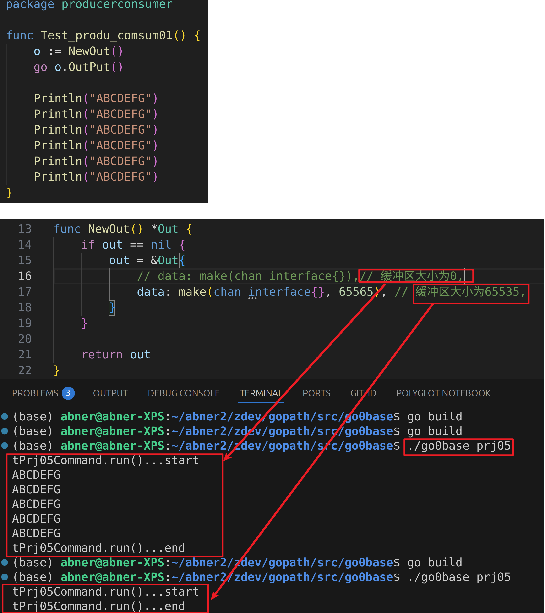
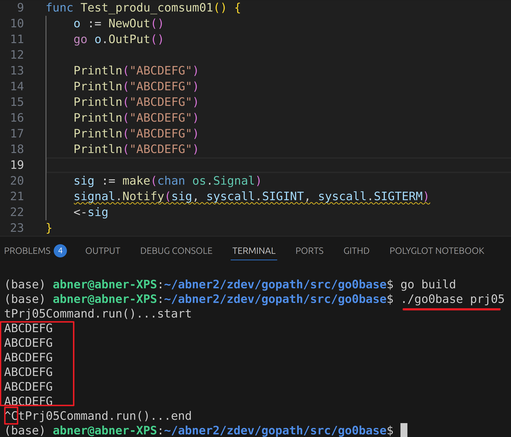
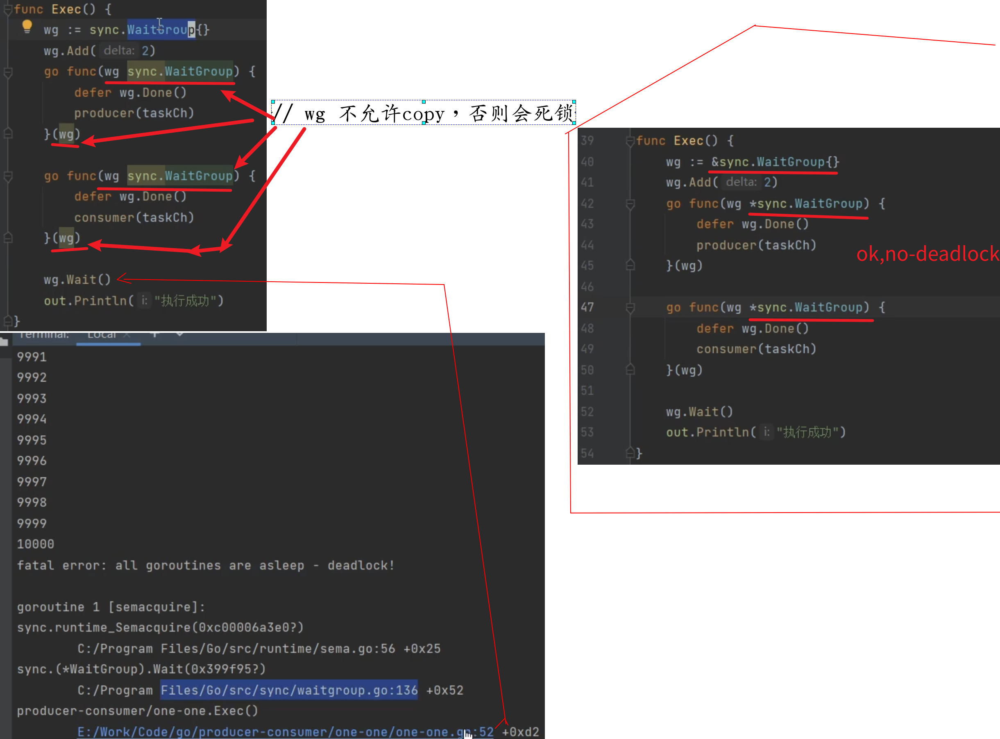
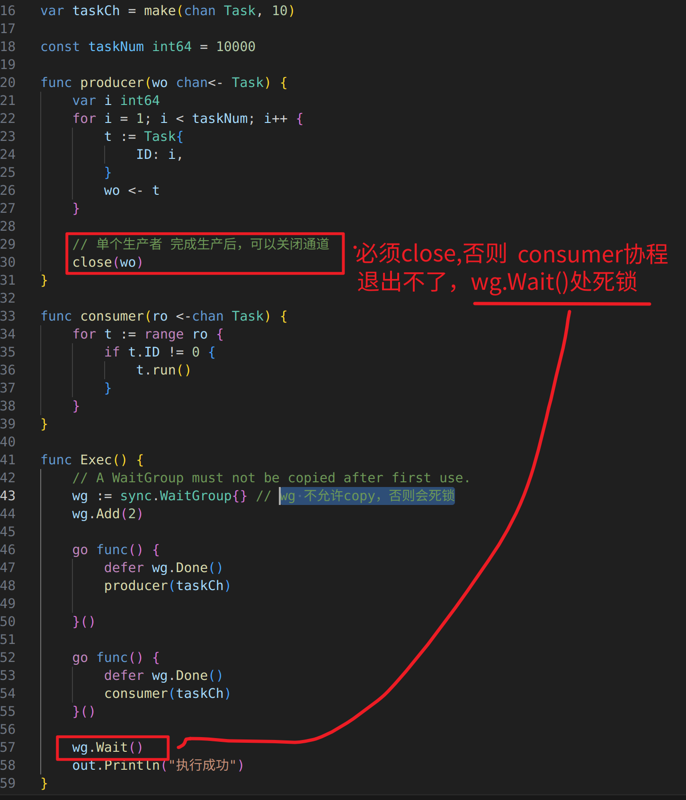
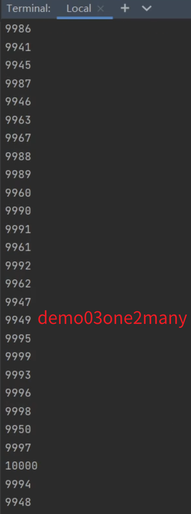

# 2025年最新Golang保姆级公开课教程-零基础也可学！（完整版）
2024-12-31 14:17:39
https://www.bilibili.com/video/BV1Y26GYhEGq?spm_id_from=333.788.videopod.episodes&vd_source=4212b105520112daf65694a1e5944e23&p=26
 
# 1.【go项目实战】golang实现一个内存缓存系统
02:14:11

# 2.【go项目实战】go用100行代码实现ping操作
01:36:51

# 3.【go项目实战】golang 实现ping网络指令
01:20:37

# 4.【go项目实战】golang实现点播转直播
02:04:43

======================================================
# 5.【go项目实战】golang实现生产者消费者模式
01:46:40 producer-consumer
https://www.bilibili.com/video/BV1Y26GYhEGq?spm_id_from=333.788.videopod.episodes&vd_source=4212b105520112daf65694a1e5944e23&p=44

## 5.1 contents
> golang实现生产者消费者模式
> 1.channel 的特点和关闭原则
> 2.不同的生产消费场景channel该如何关闭
> 3.生产者消费者四种场景具体实现
>     1个生产者 1个消费者；
>     1个生产者 多个消费者；
>     多个生产者 1个消费者；
>     多个生产者 多个消费者；

## 5.1 例1
io操作是串行的，不是并发的。多个 goroutine如果做的是io操作，会被串行。

> goprjs/05producer-consumer/out/out.go
> goprjs/05producer-consumer/demo.go

(1)在没有监听signal的情况下：
channel 缓冲区大小为0, Println("ABCDEFG") 有阻塞，会打印出来；
channel 缓冲区大小为65535, 多个Println("ABCDEFG") 没阻塞而主线程很快运行结束，“go o.OutPut()”协程没有来及运行，所以io没输出。
 

(2)在监听signal的情况下：

## 5.2 例2:one-one模式
> goprjs/05producer-consumer/one2one/one-one.go
> goprjs/05producer-consumer/demo02one2one.go
> 

(1)wg 不允许copy，否则会死锁
wg 不允许copy，否则会死锁:
 

(2)chan必须关闭，否则cosumer协程无法退出，wg.Wait()也会死锁

## 5.3 one2many
> goprjs/05producer-consumer/one2many/one-many.go
> goprjs/05producer-consumer/demo03one2many.go

 

## 5.4 many2one
 
> goprjs/05producer-consumer/many2one/many-one.go
> goprjs/05producer-consumer/demo04many2one.go

## 5.5 many2many

1:14:43
https://www.bilibili.com/video/BV1Y26GYhEGq?spm_id_from=333.788.videopod.episodes&vd_source=4212b105520112daf65694a1e5944e23&p=44

**many2many情况下，生产者和消费者都不会主动退出，只有第3方信号能让其退出。**

======================================================
# 6.【go项目实战】go实现文件上传到对象存储
01:41:16

======================================================
# 7.【go项目实战】golang实现机器人流量的拦截
02:22:37

======================================================
# 8.【go项目实战】golang基于公有云实现邮件推送
01:46:15

# 9.【go项目实战】golang基于腾讯云实现短信验证码功能
01:35:17

# 10.【go项目实战】golang腾讯云实现信息采集实名认证
01:31:17

 