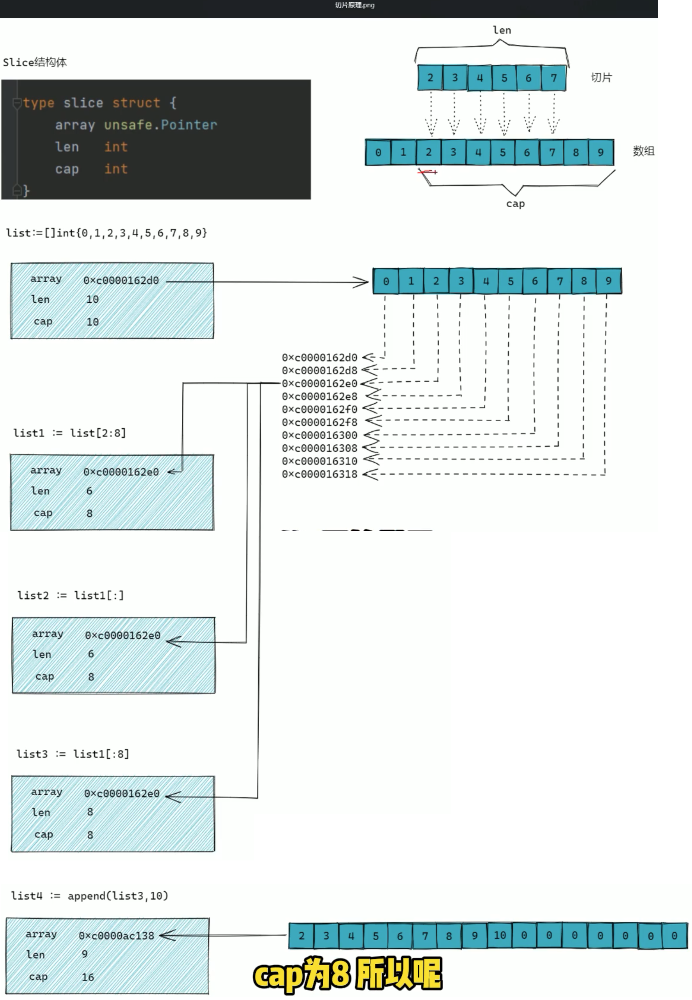
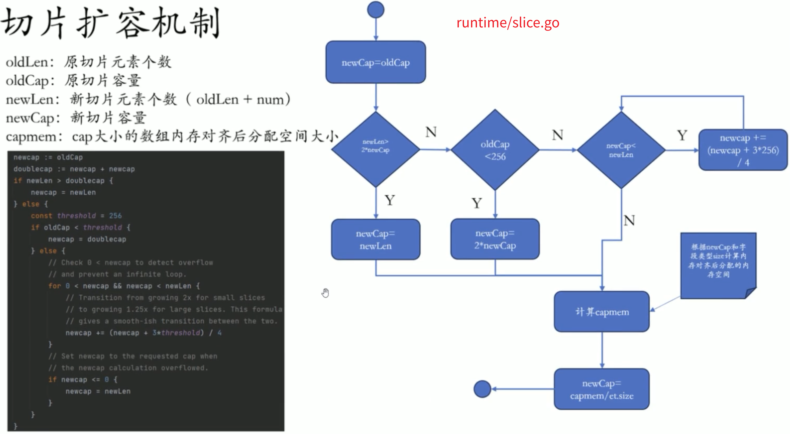
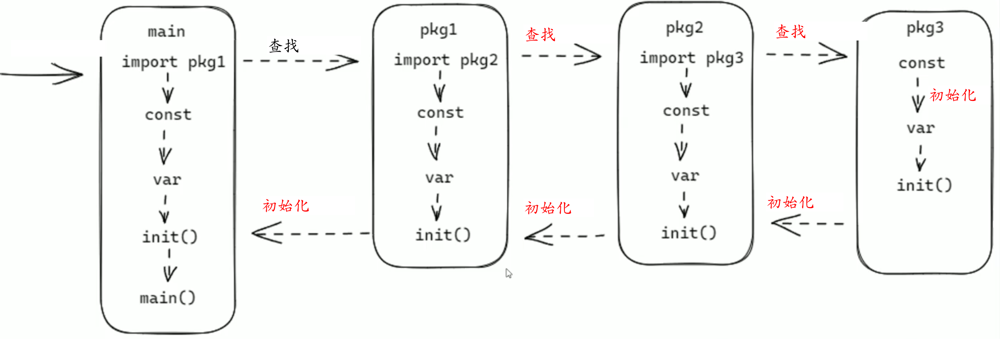
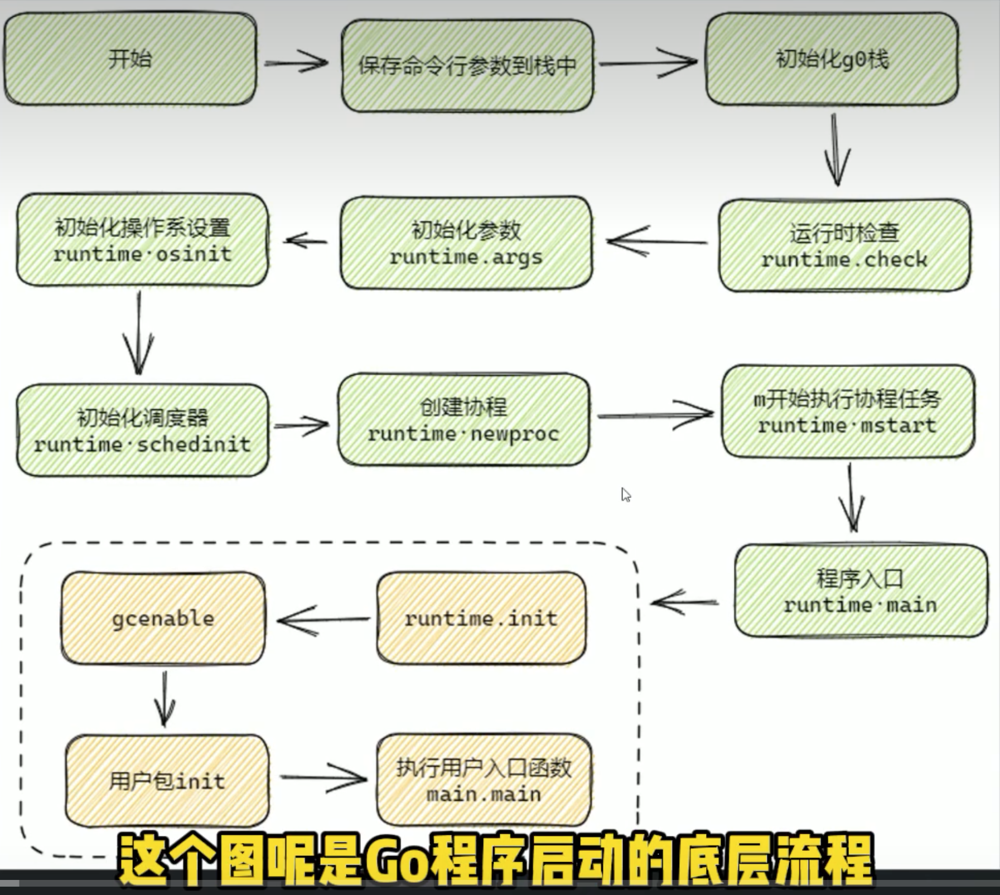
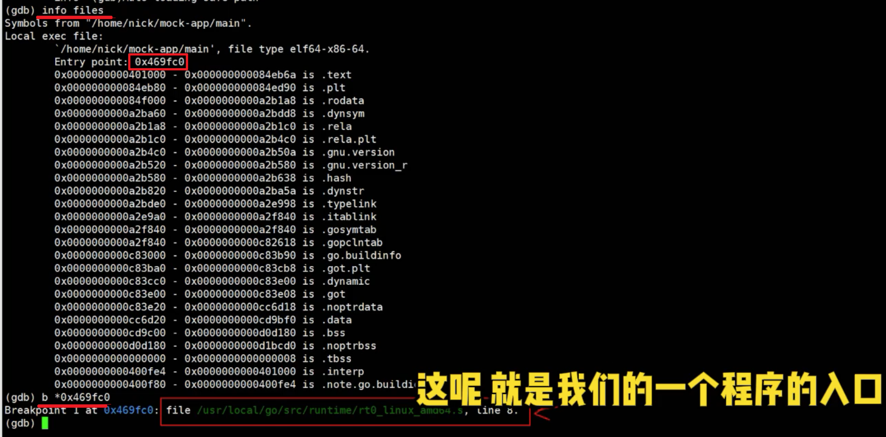
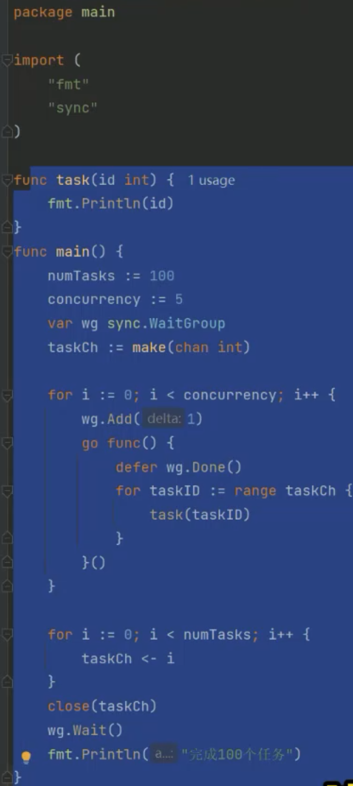
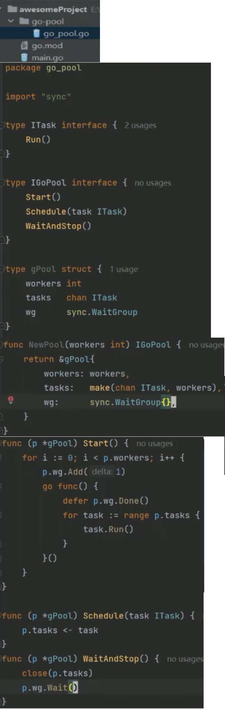
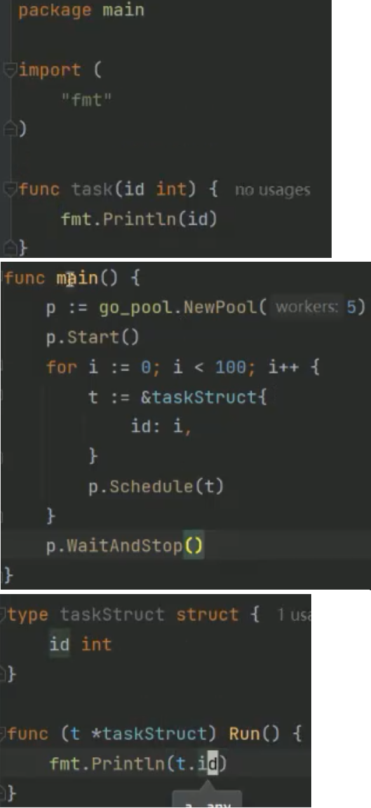

# 2025年最新Golang保姆级公开课教程-零基础也可学！（完整版）
2024-12-31 14:17:39
https://www.bilibili.com/video/BV1Y26GYhEGq?spm_id_from=333.788.videopod.episodes&vd_source=4212b105520112daf65694a1e5944e23&p=26
  

# 1.【Go大厂面试题】map基本原理
27:17


# 2.【Go大厂面试题】map可以寻址吗？
06:52


# 3.【Go大厂面试题】map的两种扩容方式
19:46


# 4.【Go大厂面试题】golang并发原语
17:32


# 5.【Go大厂面试题】golang gc三色标记法
23:08


# 6.【Go大厂面试题】golang内存逃逸现象是什么
17:25


# 7.【Go大厂面试题】golang GMP模型
04:27

==================================================
# 8.【Go大厂面试题】Redis自旋锁如何实现
15:30

==================================================
# 9.【Go大厂面试题】Redis分布式锁的实现
10:43

==================================================
# 10.【Go大厂面试题】Redis SETNX与SET NX 的区别
08:29

==================================================
# 11.【Go大厂面试题】cookie和session的区别
23:28

==================================================
# 12.【Go大厂面试题】golang切片原理
19:53
## 12.1 
 
 
 
==================================================
# 13.【Go大厂面试题】defer的作用与底层原理
17:55

==================================================
# 14.【Go大厂面试题】golang互斥锁的基本原理
22:15

==================================================
# 15.【Go大厂面试题】channel的底层实现
33:58


==================================================
==================================================
# 16.【Go大厂面试题】golang程序启动流程
19:01

## 16.1 题目：go程序启动时发生了什么
### 1.该题的面试目的 ：
  (1) 我们对自己写的这个应用程序代码执行顺序了不了解， 依赖包的加载顺序，以及包里面的 常量\全局变量\初始化函数 的执行顺序是什么 (2) Go程序启动的一个底层流程，我们了解到什么程度
### 2.启动时到底发生了什么

go程序的启动流程图：
 
**包引用之间不能有循环引用**。
go程序的启动地层流程图：
 

### 3.如何根据源码佐证
06:55
```sh
# -gcflags "-N -l"禁用编译器优化、保留栈帧,生成可执行程序 main
go build -gcflags "-N -l" main.go
```

用gdb获取go program入口地址
```sh
gdb main
(gdb)info files
```

09:12

==================================================
==================================================
# 17.【Go大厂面试题】go协程可能会引发哪些问题
12:15


==================================================
# 18.【Go大厂面试题】string和byte切片的区别
17:21

==================================================
# 19.【Go大厂面试题】golang手撕协程池
17:18 
## 19.1 simple 版本
 
```go
package main

import (
	"fmt"
	"sync"
)

func task(id int) {

	fmt.Println(id)
}

func main() {
	numTasks := 100
	concurrency := 5

	var wg sync.WaitGroup
	taskch := make(chan int)

	for i := 0; i < concurrency; i++ {
		wg.Add(1)
		go func() {
			defer wg.Done()
			for taskID := range taskch {
				task(taskID)
			}
		}()
	}

	for i := 0; i < numTasks; i++ {
		taskch <- i
	}

	close(taskch)
	wg.Wait()
	fmt.Println("完成100个任务")
}
```
## 19.2 封装版本
### （1）go-pool/go_pool.go
 
### (2)使用go_pool
 
 

==================================================
# 20.【Go大厂面试题】golang传值与传引用到底该如何选择？
24:48

==================================================
# 21.【Go大厂面试题】golang读写锁的基本原理
24:06

==================================================
# 22.【Go大厂面试题】go实现一个消息处理协程池
14:18

==================================================
# 23.【Go大厂面试题】go实现一个简单的cache
04:46

==================================================
# 24.【Go大厂面试题】context的使用场景
15:01

==================================================
# 25.【Go大厂面试题】channel底层结构
13:12

==================================================
# 26.【Go大厂面试题】go实现一个简单的多态
06:48

==================================================
# 27.【Go大厂面试题】进程、线程、协程、go协程的区别
11:53

==================================================
# 28.【Go大厂面试题】golang同步锁有什么特点？作用是什么
07:55

==================================================
# 29.【Go大厂面试题】golang中的new和make的用法与区别
14:16

==================================================
# 30.【Go大厂面试题】grpc协程溢出与grpc连接池实现
30:25

==================================================
# 31.【Go大厂面试题】panic与匿名函数的异常捕获和处理
05:01

==================================================
# 32.【Go大厂面试题】面向对象的三大核心概念和5个基本原则
33:54